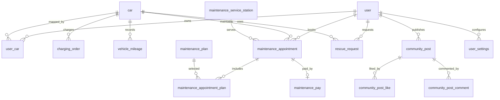

# Simple Car 数据库设计稿

这份稿子基于当前 `schema.sql`、`add_features.sql`、`new_tables.sql`、`user_settings.sql` 的现有结构整理，并补充后台管理、JWT 鉴权、权限扩展和运营审计的设计建议。

## 设计目标

- 车主端围绕用户、车辆、补能、维保、救援、社区形成闭环。
- 后台管理端按“用户资产、服务运营、社区内容、系统权限”拆分模块。
- 业务状态使用整数枚举，接口层统一解释，便于移动端和后台端共用。
- 核心关系保留外键语义，即使 MySQL 表未强制建立外键，也要在代码和索引中体现关联。

## 核心 ER 草图



## 表分层

| 模块 | 表 | 说明 |
| --- | --- | --- |
| 账号与设置 | `user`, `user_settings` | 车主账号、状态、偏好设置 |
| 车辆资产 | `car`, `user_car`, `vehicle_mileage`, `vehicle_violation` | 车辆主数据、车主关系、里程和违章信息 |
| 充电补能 | `charging_station`, `charging_order` | 充电站资源和充电订单 |
| 维保服务 | `maintenance_service_station`, `maintenance_plan`, `maintenance_appointment`, `maintenance_appointment_plan`, `maintenance_pay` | 服务站、套餐、预约、预约项目和支付 |
| 道路救援 | `rescue_request` | 救援位置、联系方式、处理状态 |
| 内容社区 | `community_post`, `community_post_like`, `community_post_comment` | 动态、点赞、评论 |
| 通知公告 | `notice` | 系统公告、运营通知 |

## 关键表设计

### user

现状字段：`id`, `username`, `password`, `nick_name`, `phone`, `status`, `created_at`, `updated_at`。

建议：

- `username` 当前适合做手机号登录账号，继续保留唯一索引。
- `password` 已接入 Spring Security `PasswordEncoder`，存储值应逐步迁移为 `{bcrypt}` 前缀格式。
- `status`: `0` 禁用，`1` 正常。JWT 过滤器已按禁用状态拒绝认证。
- 后台权限不要直接塞在 `user` 表里，建议新建独立后台账号体系。

### car 与 user_car

`car` 存车辆主数据，`user_car` 存用户和车辆关系。

建议：

- `car.license_tag` 建唯一索引，避免同车牌重复录入。
- `car.frame_number` 建唯一索引，作为车辆真实唯一标识。
- `user_car(user_id, car_id)` 建组合唯一索引，避免重复绑定。
- `user_car.is_default` 可以配合业务保证每个用户最多一辆默认车。

### charging_order

用于记录补能订单、支付金额、充电量、时长等。

建议：

- 增加 `order_no` 唯一业务单号。
- 订单状态建议统一为：`0` 待支付，`1` 充电中，`2` 已完成，`3` 已取消，`4` 异常。
- 后台总览营收应优先统计已完成订单，避免把取消或异常订单算入收入。

### maintenance_appointment

维保预约是后台运营核心工单。

建议：

- `work_no` 唯一索引，作为工单号。
- `status`: `0` 待确认，`1` 处理中，`2` 已完成，`3` 已取消。
- `appoint_date`, `appoint_time`, `service_station_id` 建联合索引，方便查某站点某天排班。
- 金额字段用 `decimal(10,2)`，不要用浮点。

### rescue_request

救援请求通常是高优先级运营数据。

建议：

- `status`: `0` 待处理，`1` 救援中，`2` 已完成，`3` 已取消。
- 增加 `assigned_staff_id` 或 `assigned_staff_name`，后续能做派单。
- 增加 `handled_at`, `finished_at`，方便统计响应时长。
- `user_id`, `status`, `create_time` 建索引，用于后台队列查询。

### community_post

社区内容需要兼顾展示和审核。

建议：

- `is_hot` 可以保留，但更建议增加 `audit_status`: `0` 待审，`1` 通过，`2` 驳回。
- 删除内容建议用软删除字段 `deleted_at` 或 `is_deleted`，保留审计证据。
- 点赞表建议对 `(post_id, user_id)` 建唯一索引。

## 后台权限扩展建议

当前项目用 `user` 登录即可访问 `/admin/**`，适合课程或原型，但生产化建议拆后台账号：

```sql
create table admin_user (
  id bigint primary key auto_increment,
  username varchar(64) not null unique,
  password varchar(255) not null,
  display_name varchar(64),
  status tinyint not null default 1,
  last_login_at datetime,
  created_at datetime default current_timestamp,
  updated_at datetime default current_timestamp on update current_timestamp
);

create table admin_role (
  id bigint primary key auto_increment,
  role_code varchar(64) not null unique,
  role_name varchar(64) not null,
  created_at datetime default current_timestamp
);

create table admin_user_role (
  id bigint primary key auto_increment,
  admin_user_id bigint not null,
  role_id bigint not null,
  unique key uk_admin_user_role (admin_user_id, role_id)
);

create table admin_operation_log (
  id bigint primary key auto_increment,
  admin_user_id bigint,
  action varchar(128) not null,
  target_type varchar(64),
  target_id bigint,
  request_ip varchar(64),
  detail json,
  created_at datetime default current_timestamp
);
```

配套思路：

- JWT claims 里放 `sub=username`、`roles=["ADMIN"]`、`iat`、`exp`。
- Spring Security 中把 `/admin/**` 改为 `hasRole("ADMIN")`。
- 用户端 `user` 表继续服务车主 App，后台账号独立管理，避免普通车主 token 访问后台。
- 所有删除、禁用、状态流转写入 `admin_operation_log`，后台追责会轻松很多。

## 索引建议

| 表 | 建议索引 | 用途 |
| --- | --- | --- |
| `user` | `uk_username(username)`, `idx_phone(phone)`, `idx_status(status)` | 登录、搜索、禁用过滤 |
| `car` | `uk_license_tag(license_tag)`, `uk_frame_number(frame_number)` | 车辆唯一性 |
| `user_car` | `uk_user_car(user_id, car_id)`, `idx_car_id(car_id)` | 用户车辆查询 |
| `charging_order` | `idx_user_time(user_id, create_time)`, `idx_car_time(car_id, create_time)`, `idx_status(status)` | 订单列表和统计 |
| `maintenance_appointment` | `uk_work_no(work_no)`, `idx_station_date(service_station_id, appoint_date)`, `idx_user_status(user_id, status)` | 后台工单、排班 |
| `rescue_request` | `idx_status_time(status, create_time)`, `idx_user_time(user_id, create_time)` | 救援队列 |
| `community_post` | `idx_user_time(user_id, create_time)`, `idx_hot_time(is_hot, create_time)` | 社区列表 |
| `community_post_like` | `uk_post_user(post_id, user_id)` | 防重复点赞 |

## 状态字典

| 场景 | 字段 | 值 |
| --- | --- | --- |
| 用户 | `user.status` | `0` 禁用，`1` 正常 |
| 车辆 | `car.car_state` | `0` 离线，`1` 在线，`2` 静止，`3` 启动 |
| 维保预约 | `maintenance_appointment.status` | `0` 待确认，`1` 处理中，`2` 已完成，`3` 已取消 |
| 救援 | `rescue_request.status` | `0` 待处理，`1` 救援中，`2` 已完成，`3` 已取消 |
| 站点 | `charging_station.status`, `maintenance_service_station.status` | `0` 停用，`1` 运营 |
| 社区 | `community_post.is_hot` | `0` 普通，`1` 热门 |

## 落地顺序建议

1. 先统一 `schema.sql`，把重复的社区表和通知表合并，避免初始化脚本重复建表。
2. 给用户、车辆、工单、救援、社区增加关键索引。
3. 后台账号从 `user` 表拆到 `admin_user`，再把 `/admin/**` 切到角色鉴权。
4. 给后台状态流转加 `admin_operation_log`，方便定位误删、误禁用、误改状态。
5. 最后再补报表聚合表或日统计表，避免后台首页每次扫全量订单。
