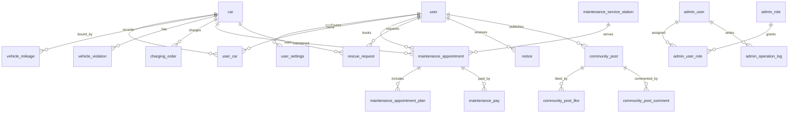

# Simple Car 数据库设计

这份文档对应新的统一脚本：

- `simple-car-server/src/main/resources/rebuild_database.sql`
- `simple-car-server/src/main/resources/init_database.sql`

`rebuild_database.sql` 是当前数据库基准脚本，会删除并重建 `simple_car` 数据库，适合本地完全重构、课程演示环境重置和种子数据恢复。旧的 `schema.sql`、`data.sql`、`add_features.sql`、`new_tables.sql`、`admin_auth.sql`、`user_settings.sql` 暂时保留作历史对照，但不再作为推荐入口。

## 重构目标

- 单一入口：初始化不再依赖多个分散 SQL 文件，避免重复建表和漏执行。
- 贴合代码：表名和字段名以现有 MyBatis-Plus 实体为准，不额外要求后端同步重构。
- 关系清晰：核心表补充外键、唯一约束和查询索引，让关系在数据库层也可读。
- 数据可演示：内置后台账号、车主账号、车辆、维保、充电、救援、违章、通知和社区种子数据。
- 可重建：脚本明确是重建脚本，适用于干净初始化，不作为线上迁移脚本使用。

## 执行方式

在 `simple-car-server/src/main/resources` 目录下执行：

```bash
mysql -uroot -p < init_database.sql
```

或直接执行：

```bash
mysql -uroot -p < rebuild_database.sql
```

注意：脚本包含 `DROP DATABASE IF EXISTS simple_car`，执行前请确认本地数据已经备份。

## 默认账号

后台管理端：

| 账号 | 密码 | 角色 |
| --- | --- | --- |
| `admin` | `123456` | `ROLE_ADMIN` |

车主客户端：

| 账号 | 密码 | 昵称 |
| --- | --- | --- |
| `13800000000` | `123456` | 张三 |
| `13912345678` | `123456` | 李四 |

当前脚本使用 `{bcrypt}` 哈希保存默认演示密码 `123456`。生产环境应为每个账号重新生成独立密码并强制修改默认口令。

## 核心 ER 图



## 表分组

| 模块 | 表 | 说明 |
| --- | --- | --- |
| 车主账号 | `user`, `user_settings` | 车主登录信息和通知、隐私等配置 |
| 后台权限 | `admin_user`, `admin_role`, `admin_user_role`, `admin_operation_log` | 后台登录、角色授权和操作审计 |
| 车辆资产 | `car`, `user_car`, `vehicle_mileage`, `vehicle_violation` | 车辆档案、绑定关系、里程和违章 |
| 充电服务 | `charging_station`, `charging_order` | 充电站和车辆充电订单 |
| 维保服务 | `maintenance_service_station`, `maintenance_plan`, `maintenance_appointment`, `maintenance_appointment_plan`, `maintenance_pay` | 服务站、维保套餐、预约工单、工单项目和支付 |
| 道路救援 | `rescue_request` | 救援位置、联系人、车辆和处理状态 |
| 通知社区 | `notice`, `community_post`, `community_post_like`, `community_post_comment` | 公告通知、社区动态、点赞和评论 |

## 关键表说明

### `user`

车主账号表。`username` 是登录账号并唯一，当前种子数据使用手机号作为账号。`status` 只表达账号是否可用：`0` 禁用，`1` 正常。

### `admin_user` / `admin_role` / `admin_user_role`

后台账号独立于车主账号。Spring Security 访问 `/admin/**` 时依赖后台账号和 `ROLE_ADMIN` 角色，不再让普通车主 token 混用后台权限。

### `car` / `user_car`

`car` 存车辆主档，`user_car` 存用户和车辆的绑定关系。`license_tag` 和 `frame_number` 都做唯一索引，避免重复录入；`user_car(user_id, car_id)` 做唯一索引，避免重复绑定。

### `charging_station` / `charging_order`

充电站按 `city_id + status` 查询，客户端可用 `available_piles > 0` 过滤可用站点。充电订单当前代码只绑定车辆，所以脚本没有额外增加 `station_id`，避免和实体不一致。

### `maintenance_appointment`

维保预约是运营后台的核心工单。`work_no` 唯一，`maintenance_service_station_id + appoint_date` 有索引，方便后续做站点排班。工单项目明细会复制 `maintenance_plan` 的价格和项目文本，保留历史价格。

### `rescue_request`

救援请求绑定用户，可选绑定车辆。后台常用 `status + create_time` 看待处理队列，车主端常用 `user_id + create_time` 看历史请求。

### `community_post`

社区动态保留计数字段 `like_count`、`comment_count`、`share_count`，点赞表使用 `post_id + user_id` 唯一索引防止重复点赞。

## 状态字典

| 场景 | 字段 | 值 |
| --- | --- | --- |
| 车主账号 | `user.status` | `0` 禁用，`1` 正常 |
| 后台账号 | `admin_user.status` | `0` 禁用，`1` 正常 |
| 车辆状态 | `car.car_state` | `0` 离线，`1` 在线，`2` 静止，`3` 启动 |
| 充电站 | `charging_station.status` | `0` 停用/维护，`1` 运营 |
| 维保服务站 | `maintenance_service_station.status` | `0` 停用，`1` 营业 |
| 维保预约 | `maintenance_appointment.status` | `0` 待确认/待支付，`1` 处理中/维保中，`2` 已完成，`3` 已取消 |
| 维保支付 | `maintenance_pay.status` | `0` 待支付，`1` 已支付，`2` 已取消 |
| 救援请求 | `rescue_request.status` | `0` 待处理，`1` 救援中，`2` 已完成，`3` 已取消 |
| 违章记录 | `vehicle_violation.status` | `0` 未处理，`1` 已处理 |
| 通知类型 | `notice.type` | `1` 系统，`2` 维保，`3` 充电 |
| 社区动态 | `community_post.is_hot` | `0` 普通，`1` 热门 |

## 主要索引

| 表 | 索引 | 用途 |
| --- | --- | --- |
| `user` | `uk_user_username`, `idx_user_phone`, `idx_user_status` | 登录、搜索和状态过滤 |
| `admin_user` | `uk_admin_user_username`, `idx_admin_user_status` | 后台登录和禁用过滤 |
| `car` | `uk_car_license_tag`, `uk_car_frame_number`, `idx_car_state` | 车辆唯一性和状态筛选 |
| `user_car` | `uk_user_car`, `idx_user_car_user_default` | 绑定去重和默认车辆查询 |
| `vehicle_mileage` | `idx_vehicle_mileage_car_time` | 里程趋势图 |
| `vehicle_violation` | `idx_vehicle_violation_car_time`, `idx_vehicle_violation_status` | 违章列表和处理状态 |
| `charging_station` | `idx_charging_station_city_status`, `idx_charging_station_available` | 城市站点和可用电桩过滤 |
| `charging_order` | `idx_charging_order_car_time` | 车辆充电历史和收入统计 |
| `maintenance_appointment` | `uk_maintenance_work_no`, `idx_maintenance_user_status`, `idx_maintenance_station_date` | 工单查询、车主历史、站点排班 |
| `maintenance_pay` | `idx_maintenance_pay_appointment`, `idx_maintenance_pay_status` | 支付状态和工单支付查询 |
| `rescue_request` | `idx_rescue_user_time`, `idx_rescue_status_time` | 车主救援历史和后台待处理队列 |
| `notice` | `idx_notice_user_time`, `idx_notice_type_time` | 用户通知和公告类型查询 |
| `community_post` | `idx_post_user_time`, `idx_post_hot_time` | 社区信息流和热门内容 |
| `community_post_like` | `uk_post_like_user` | 防止重复点赞 |
| `community_post_comment` | `idx_post_comment_post_time` | 评论列表 |

## 设计约束

- 这不是线上迁移脚本，而是本地重建脚本；如果已有重要数据，应先备份再执行。
- 表名暂时保留后端当前命名，比如 `car`、`user_car`、`maintenance_service_station`，避免一次改动同时牵扯实体、接口和前端。
- 外键只覆盖当前代码中的确定关系，像充电订单的站点归属暂未扩展，因为实体目前没有 `station_id`。
- 社区头像字段是 Mapper 查询时生成的临时字段，不落库；`User.avatar` 目前也标记为 `@TableField(exist = false)`。
- 后续如果要做生产化迁移，应新增版本化 migration 文件，而不是继续直接修改 `rebuild_database.sql`。
